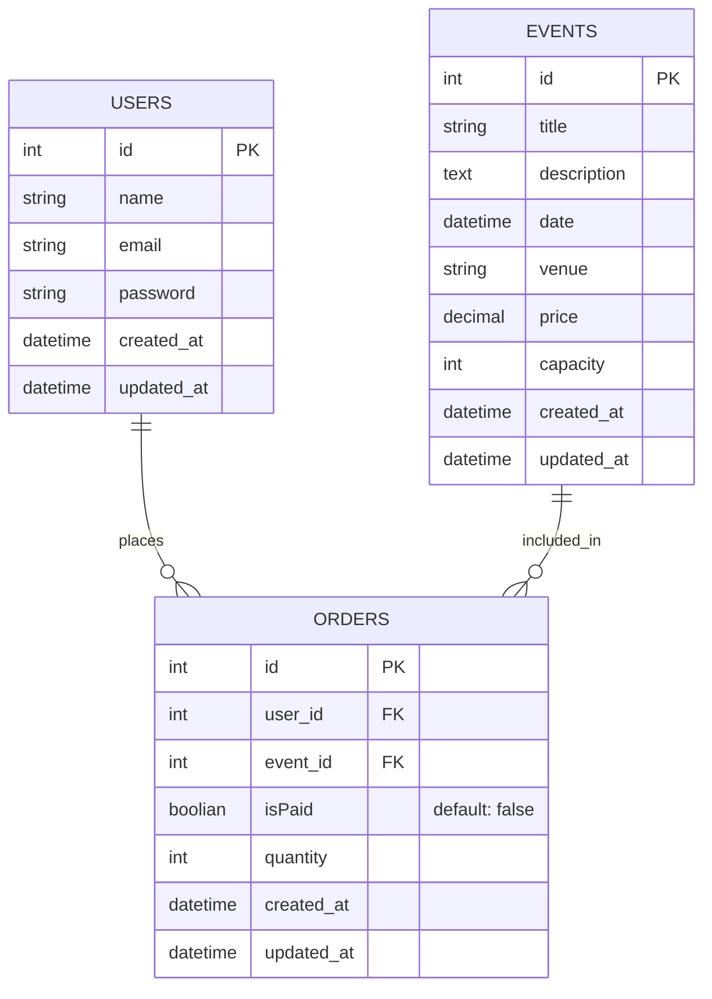

## Entity Relationship Diagram (ERD)



## SQL Queries

### Events

Get all events:

```sql
SELECT id, price, currency, title, description, created_at, updated_at
FROM events
ORDER BY id ASC;
```

Get event by ID:

```sql
SELECT id, price, currency, title, description, created_at, updated_at
FROM events
WHERE id = 1;
```

### Users

Get all users:

```sql
SELECT id, full_name, email, created_at, updated_at
FROM users
ORDER BY id ASC;
```

Get user by ID:

```sql
SELECT id, full_name, email, created_at, updated_at
FROM users
WHERE id = 1;
```


