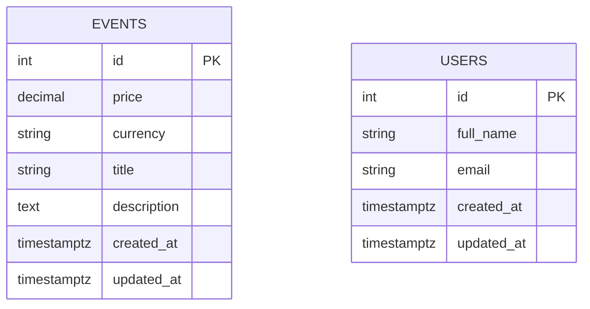

## Entity Relationship Diagram (ERD)

```mermaid
erDiagram
    EVENTS {
        int id PK
        decimal price
        string currency
        string title
        text description
        timestamptz created_at
        timestamptz updated_at
    }
     USERS {
        int id PK
        string full_name
        string email
        timestamptz created_at
        timestamptz updated_at
    }
```

