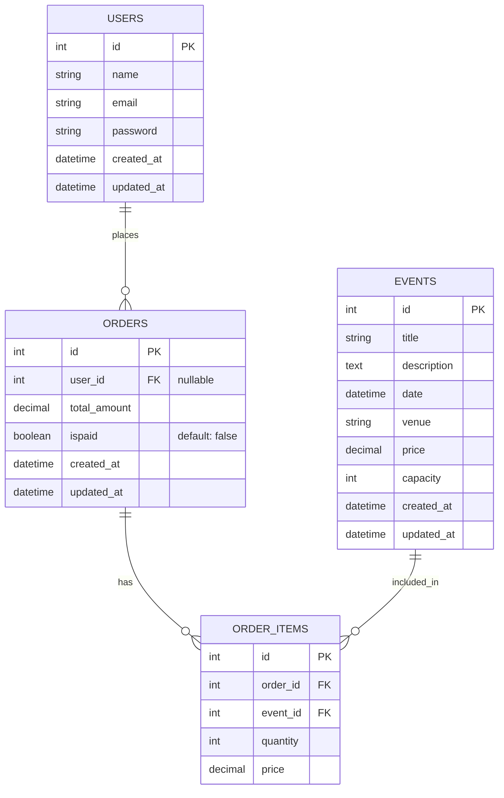

# Database Documentation

This folder contains database documentation assets for the Events Startup API:

- PostgreSQL ERD image: `postgreSQL-erd-diagram.png`
- pgAdmin ERD source: `postgreSQL-erd-diagram.pgerd`

The source of truth for schema changes is in migrations:

- `api/src/db/migrations/20260228-1200_create_events_table.js`
- `api/src/db/migrations/20260508-1633_create_users_table.js`
- `api/src/db/migrations/20260508-1850_create_orders_table.js`
- `api/src/db/migrations/20260508-1900_create_order_items_table.js`

## Current Schema Summary

### `events`

- `id` integer identity, primary key
- `title` string, required
- `description` text, optional
- `date` datetime, required
- `venue` string, required
- `price` decimal(10,2), required
- `capacity` integer, required
- `created_at`, `updated_at` timestamps

### `users`

- `id` integer identity, primary key
- `name` string(50), required
- `email` string(50), required, unique
- `password` string, required
- `created_at`, `updated_at` timestamps

### `orders`

- `id` integer identity, primary key
- `user_id` integer, nullable, foreign key to `users.id`
- `total_amount` decimal(10,2), required
- `ispaid` boolean, required, default `false`
- `created_at`, `updated_at` timestamps

Foreign key behavior:

- `user_id` updates on user id change (`CASCADE`)
- `user_id` becomes `NULL` if user is deleted (`SET NULL`)

### `order_items`

- `id` integer identity, primary key
- `order_id` integer, required, foreign key to `orders.id`
- `event_id` integer, required, foreign key to `events.id`
- `quantity` integer, required
- `price` decimal(10,2), required

Foreign key behavior:

- deleting an `orders` row cascades and deletes related `order_items`
- deleting an `events` row cascades and deletes related `order_items`

## Relationships (ERD)



## Setup Commands

Run these commands from the `api` folder:

```bash
npm run db:migrate
npm run db:seed
```

Or run both in one step:

```bash
npm run db:setup
```

Useful reset commands:

```bash
npm run db:rollback
npm run db:rollbackall
```

## Seed Files

Seeds live in `api/src/db/seeds` and currently include:

- `001_events.js`
- `002_users.js`
- `003_orders.js`
- `004_order_items.js`

The order matters because later seed files depend on records created by earlier ones.

## SQL Queries

These examples use PostgreSQL positional parameters like `$1` and `$2`.

### Events

Get all events:

```sql
SELECT *
FROM events
ORDER BY id ASC;
```

Get event by ID:

```sql
SELECT *
FROM events
WHERE id = $1;
```

### Users

Get all users:

```sql
SELECT *
FROM users
ORDER BY id ASC;
```

Get user by ID:

```sql
SELECT *
FROM users
WHERE id = $1;
```

### Orders

Get paginated orders:

```sql
SELECT *
FROM orders
ORDER BY created_at DESC, id DESC
LIMIT $1 OFFSET $2;
```

Get order by ID:

```sql
SELECT
    o.id AS order_id,
    o.user_id,
    u.name AS user_name,
    u.email AS user_email,
    o.total_amount,
    o.ispaid,
    o.created_at,
    o.updated_at,
    oi.id AS order_item_id,
    oi.event_id,
    e.title AS event_title,
    e.venue AS event_venue,
    e.date AS event_date,
    oi.quantity,
    oi.price AS item_price
FROM orders AS o
LEFT JOIN users AS u ON u.id = o.user_id
LEFT JOIN order_items AS oi ON oi.order_id = o.id
LEFT JOIN events AS e ON e.id = oi.event_id
WHERE o.id = $1
ORDER BY oi.id ASC;
```

## ERD Assets


Open `postgreSQL-erd-diagram.pgerd` in pgAdmin to edit the ERD source.