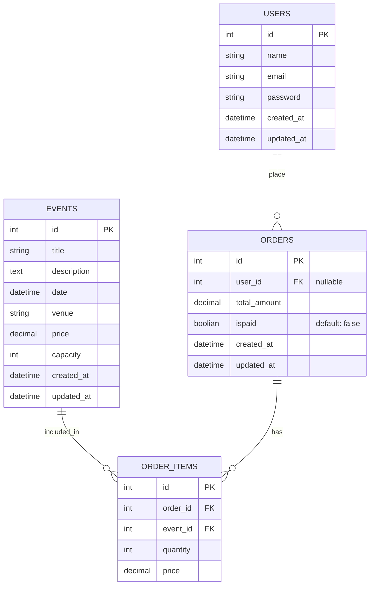
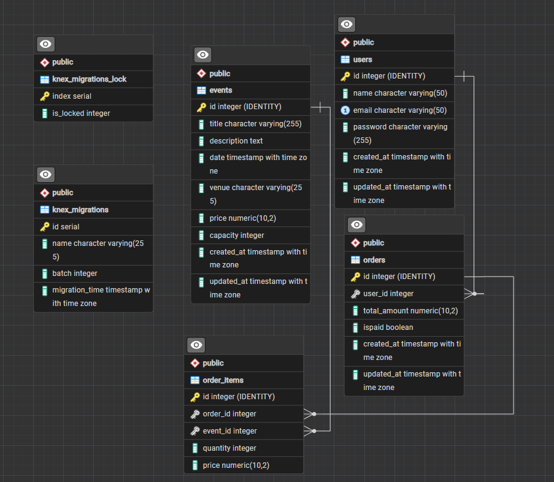

## Entity Relationship Diagram With Mermaild (ERD)



## SQL Queries

### Events

Get all events:

```sql
SELECT *
FROM events
ORDER BY id ASC;
```

Get event by ID:

```sql
SELECT *
FROM events
WHERE id = @id;
```

### Users

Get all users:

```sql
SELECT *
FROM users
ORDER BY id ASC;
```

Get user by ID:

```sql
SELECT *
FROM users
WHERE id = @id;
```

### Orders

Get all orders:

```sql
SELECT *
FROM orders
ORDER BY id ASC;
```

Get order by ID:

```sql
SELECT *
FROM orders
WHERE id = @id;
```

## Exported ERD diagram from PostgreSQL by pgAdmin4



See the [postgreSQL-erd-diagram.pgerd](postgreSQL-erd-diagram.pgerd) as the pgAdmin ERD source file.