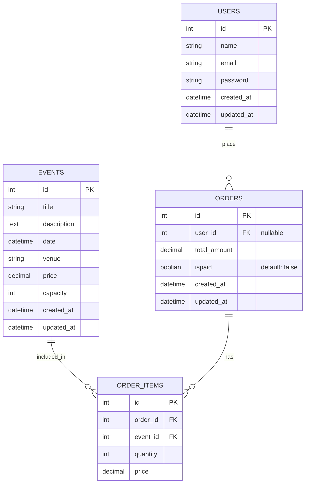

## Entity Relationship Diagram With Mermaild (ERD)



## SQL Queries

### Events

Get all events:

```sql
SELECT *
FROM events
ORDER BY id ASC;
```

Get event by ID:

```sql
SELECT *
FROM events
WHERE id = @id;
```

### Users

Get all users:

```sql
SELECT *
FROM users
ORDER BY id ASC;
```

Get user by ID:

```sql
SELECT *
FROM users
WHERE id = @id;
```

### Orders

Get orders by pagination:

```sql
SELECT *
FROM orders
ORDER BY created_at DESC, id DESC
LIMIT @limit OFFSET @offset;
```

Get full order details by ID (with user, items, and events):

```sql
SELECT
    o.id AS order_id,
    o.user_id,
    u.name AS user_name,
    u.email AS user_email,
    o.total_amount,
    o.ispaid,
    o.created_at,
    o.updated_at,
    oi.id AS order_item_id,
    oi.event_id,
    e.title AS event_title,
    e.venue AS event_venue,
    e.date AS event_date,
    oi.quantity,
    oi.price AS item_price
FROM orders AS o
LEFT JOIN users AS u ON u.id = o.user_id
LEFT JOIN order_items AS oi ON oi.order_id = o.id
LEFT JOIN events AS e ON e.id = oi.event_id
WHERE o.id = @order_id
ORDER BY oi.id ASC;
```

## Exported ERD diagram from PostgreSQL by pgAdmin4


See the [postgreSQL-erd-diagram.pgerd](postgreSQL-erd-diagram.pgerd) as the pgAdmin ERD source file.