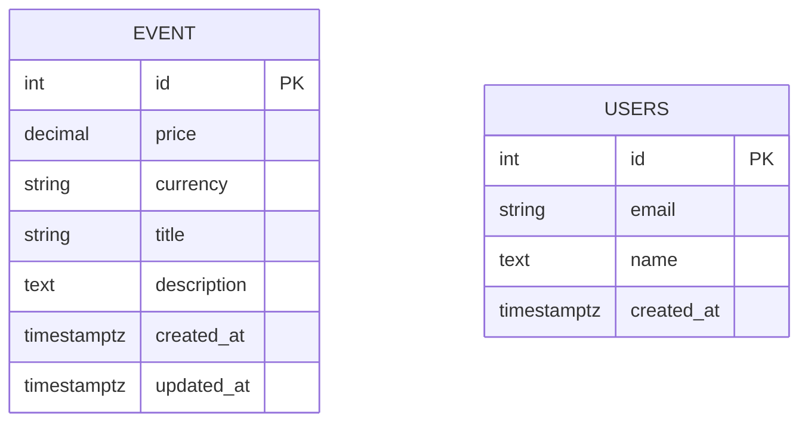

# Event Database Schema
## Entity Relationship Diagram (ERD)

```mermaid
erDiagram
    EVENT {
        int id PK
        decimal price
        string currency
        string title
        text description
        timestamptz created_at
        timestamptz updated_at
    }


 USERS {
        int id PK
        string email
        text name
        timestamptz created_at
    }

```

